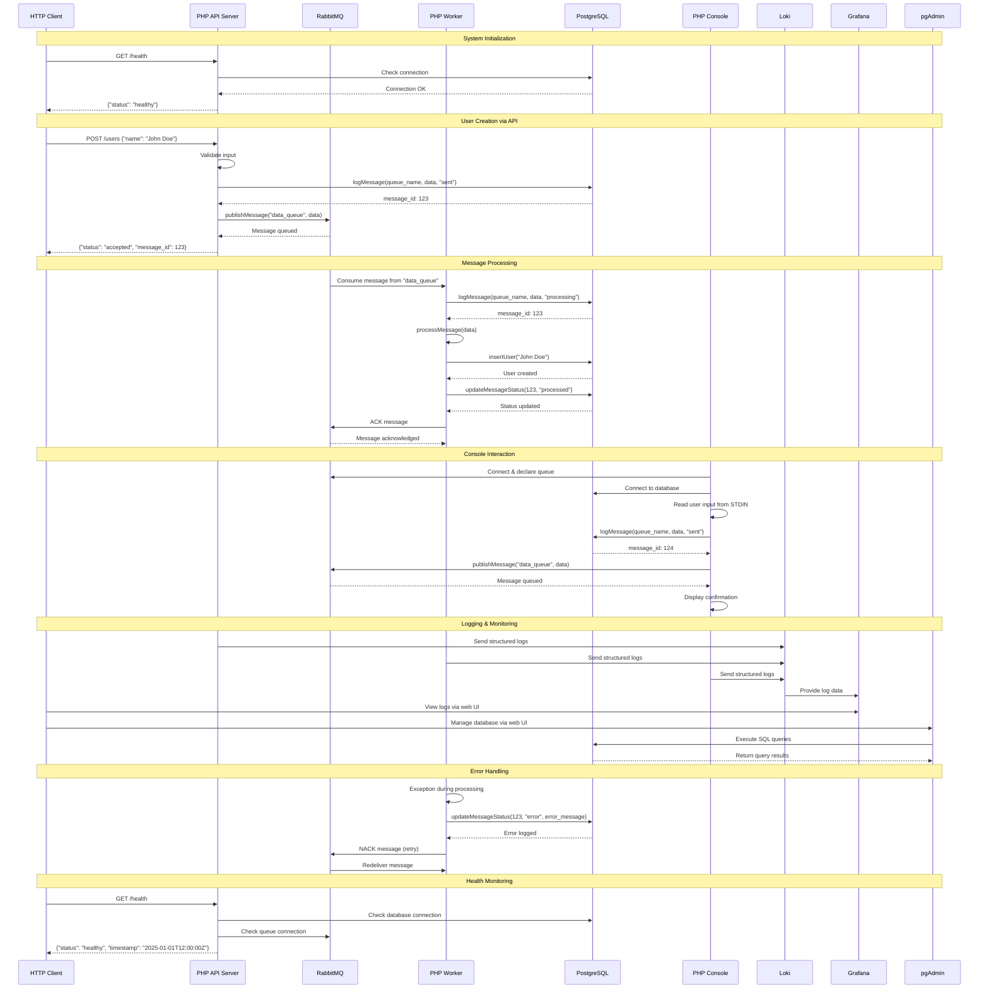
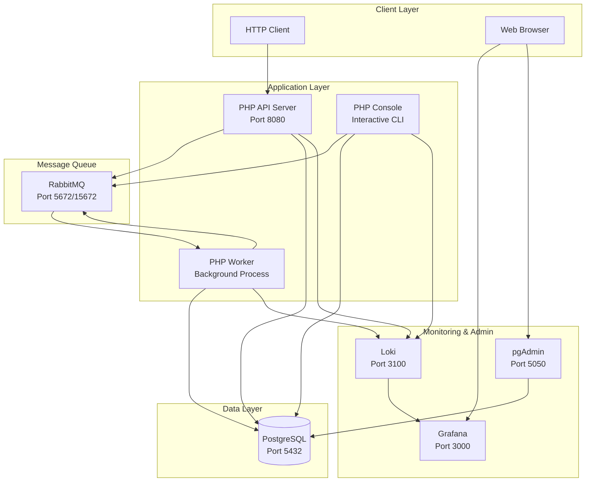
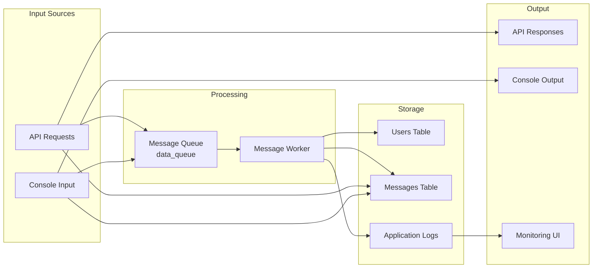

# UML Sequence Diagram - RabbitMQ PHP PostgreSQL Project

## Process Interaction Flow

## Component Architecture

## Data Flow Diagram

## Key Interactions Explained

### 1. **API Request Flow**
- Client sends HTTP POST to `/users`
- API validates input and logs message to database
- API publishes message to RabbitMQ queue
- API returns immediate response (202 Accepted)

### 2. **Message Processing Flow**
- Worker consumes messages from RabbitMQ
- Worker logs processing start to database
- Worker processes the message (creates user)
- Worker updates message status to "processed"
- Worker acknowledges message to RabbitMQ

### 3. **Console Interaction Flow**
- Console connects to RabbitMQ and database
- User inputs data via STDIN
- Console logs and publishes message
- Console displays confirmation

### 4. **Error Handling Flow**
- If processing fails, worker logs error to database
- Worker sends NACK to RabbitMQ for retry
- Message is redelivered for retry processing

### 5. **Monitoring Flow**
- All services send structured logs to Loki
- Grafana queries Loki for log visualization
- pgAdmin provides direct database management

## Technology Stack

- **PHP 8.2**: Application runtime
- **RabbitMQ**: Message queuing system
- **PostgreSQL**: Primary database
- **Loki**: Log aggregation
- **Grafana**: Log visualization
- **pgAdmin**: Database administration
- **Docker**: Containerization
- **Composer**: PHP dependency management
